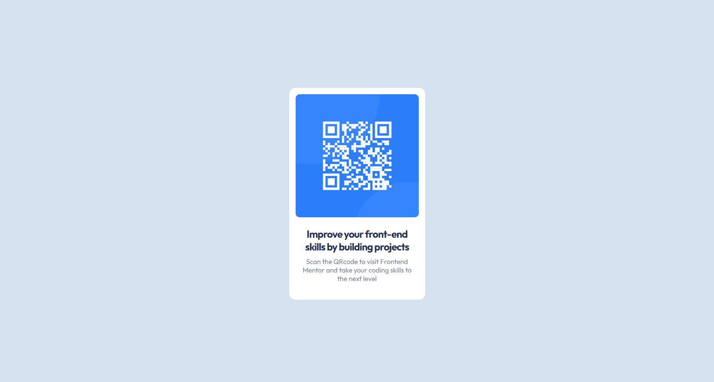

# Frontend Mentor - QR code component

## Tabela do Conteudo

<ul>
<li><a href="#sobre">Sobre</a></li>
<li><a href="#status">Status</a></li>
<li><a href="#objetivo">Objetivo</a></li>
<li><a href="#curiosidade">Curiosidade</a></li>
<li><a href="#tecnologias">Tecnologias</a></li>
<li><a href="#acessando-o-site">Acessando o site</a></li>
</ul>

## Sobre

Este é a resolução do desafio do [Frontend Mentor](https://www.frontendmentor.io/challenges/qr-code-component-iux_sIO_H) sobre criar um card no centro da tela de QR-Code.

## Status

Desafio concluido 👌

## Objetivo

Com base nos conceitos adquiridos nos cursos Dev Quest e Curso em Vídeo, pude aprender a utilizar de maneira simples o flexbox para posicionar os elementos na tela. Isso me permitiu chegar mais próximo do desafio proposto, buscando uma disposição adequada dos itens.

## Curiosidade

Esse desafio me permitiu adquirir conhecimento para criar vários cards de diferentes formas no centro da web.

## Tecnologias

<ul>
<li>HTML</li>
<li>CSS</li>
<li>GIT BASH</li>
</ul>

## Acessando o site

Para acessar o site do desafio QR code component, por favor use esse link : <a href="https://tiago-forward.github.io/desafio-qr-code-component-main/" target="_blank">QR code component</a>